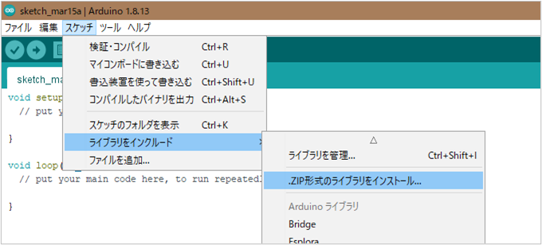

# opniz Arduino Library for ESP32


`❗ このプロジェクトは現在アルファ版です。`

opnizとはM5StackといったESP32デバイスをNode.jsからobnizライクに遠隔制御するための、**Node.js SDK**および**Arduinoライブラリ**です。  
しくみとしてはESP32デバイスおよびNode.js SDK間にて**JSON形式のRPCメッセージ**をやりとりし、相互に定義されたメソッドを呼び合います。  


現在Node.js SDK、Arduinoライブラリともに**ESP32**および**M5ATOM**クラスを実装しています。  
M5ATOMクラスで**M5Stack、M5StickC、M5ATOM Lite、M5ATOM Matrixでの動作を確認しています。**  

新たなデバイスクラスや独自のメソッドを簡単に拡張できる設計となっています。  
また**クラウド環境（PaaS、FaaS等）でも動作**させることができます。  


## Arduinoライブラリ

本リポジトリはESP32向けArduinoライブラリのリポジトリとなります。  
Node.js SDKからのRPCリクエストを処理するハンドラと、ESP32デバイスからのRPCイベントを発火するエミッタを実装したデバイスクラスを提供します。  
各M5デバイスクラスはこのクラスを継承し実装されます。  
Arduino IDEおよびPlatformIOに対応しています。  


## インストール方法

まだArduinoライブラリマネージャーにはリリースしていないため、GitHubリポジトリよりZIPをダウンロードのうえ、Arduino IDEにて「.ZIP形式のライブラリをインストール...」を選択しダウンロードしたZIPをライブラリへ追加してください。

### GitHubリポジトリからのZIPダウンロード

「Code」ボタンを押すと表示されるメニューより「Download ZIP」を選択しダウンロードします。  


### Arduino IDEでの.ZIP形式ライブラリのインストール

Arduinoのメニューより「スケッチ」→「ライブラリをインクルード」→「.ZIP形式のライブラリをインストール...」と選択し、ダウンロードしたZIPを選択します。  



### 依存ライブラリのインストール

`ArduinoJson`ライブラリと`WebSockets`ライブラリのインストールが別途必要となります。  


## 使い方

以下のコードは`Opniz::Esp32`クラスを使用した最小限のコードです。  
Arduino IDEメニューの「スケッチ例」→「opniz」→「Basic」にあるコードと同等です。  
（M5Stack、M5StickC、M5ATOMも以下のコードで動作します）  

opnizインスタンスの生成、Wi-Fi接続、Node.js SDKへの接続、そして`loop`関数内の`opniz->loop()`にてNode.js SDKからのRPCリクエストの待ち受け・ハンドリングと、デバイスへ実装されているRPCイベントの発火を行っています。  

基本的なI/O制御用ハンドラは実装済みのため、このコードをデバイスへ書き込むだけでNode.js SDKからさまざまな電子パーツが制御可能となります。  
`ssid`、`password`をお使いのWi-Fiのものに、`address`、`port`をそれぞれNode.js SDKを実行する端末のものに書き換え、デバイスにスケッチを書き込んでみてください。  
opniz Node.js SDKと連携可能になります。  

```cpp
#include <OpnizEsp32.h>
#include <lib/WiFiConnector.h>

const char* ssid = "<SSID>";         // WiFiのSSIDに書き換え
const char* password = "<PASSWORD>"; // WiFiのパスワードに書き換え
WiFiConnector wifiConnector(ssid, password); // WiFi接続ヘルパーインスタンス生成

const char* address = "192.168.0.1"; // Node.js SDKを実行する端末のIPアドレスを指定
const uint16_t port = 3000;          // Node.js SDKを実行する端末のポート番号を指定
Opniz::Esp32* opniz = new Opniz::Esp32(address, port); // opnizインスタンス生成


void setup() {
    wifiConnector.connect(); // WiFi接続
    opniz->connect();        // Node.js SDKへ接続
}

void loop() {
    opniz->loop();         // opnizメインループ
    wifiConnector.watch(); // WiFi接続監視
}
```

### ハンドラ、エミッタの拡張

実装を追加して独自に拡張できます。  
ハンドラやエミッタの追加は[`examples/AddHandler/AddHandler.ino`](./examples/AddHandler/AddHandler.ino)（以下のコード）が参考になると思います。  

```cpp
#include <OpnizEsp32.h>
#include <lib/WiFiConnector.h>
#include <M5Atom.h>

const char* ssid = "<SSID>";         // WiFiのSSIDに書き換え
const char* password = "<PASSWORD>"; // WiFiのパスワードに書き換え
WiFiConnector wifiConnector(ssid, password); // WiFi接続ヘルパーインスタンス生成

const char* address = "192.168.0.1"; // Node.js SDKを実行する端末のIPアドレスを指定
const uint16_t port = 3000;          // Node.js SDKを実行する端末のポート番号を指定
Opniz::Esp32* opniz = new Opniz::Esp32(address, port); // opnizインスタンス生成


// StringをCRGBに変換する関数
CRGB str2crgb(String color) { return strtoll(&color[1], NULL, 16) & 0xffffff; }

// 独自ハンドラを作成
class DrawpixHandler : public BaseHandler {
public:
    String name() override { return "_M5.dis.drawpix(uint8_t,CRGB):void"; };
    String procedure(JsonArray params) override {
        uint8_t number = (uint8_t)params[0];
        String color = params[1];
        M5.dis.drawpix(number, str2crgb(color));
        return "true";
    }
};

// 独自エミッタを作成
class ButtonEmitter : public BaseEmitter {
public:
    boolean canEmit() override {
        M5.Btn.read();
        return M5.Btn.wasPressed();
    };
    String emit() override {
        std::vector<String> parameters;
        parameters.emplace_back("singlePush");
        return createRpcRequest("button", parameters);
    };
};


void setup() {
    // M5ATOM初期化
    M5.begin(true, false, true);
    M5.dis.setBrightness(10);
    
    // WiFi接続
    wifiConnector.connect();
    
    // 独自ハンドラ/エミッタを登録
    opniz->addHandler({ new DrawpixHandler });
    opniz->addEmitter({ new ButtonEmitter });
    
    // Node.js SDKへ接続
    opniz->connect();
}

void loop() {
    opniz->loop();         // opnizメインループ
    wifiConnector.watch(); // WiFi接続監視
}
```


## 利用可能な通信プロトコル

opniz Arduinoライブラリでは以下の通信プロトコルを実装しています。  
デフォルトでは`WebSocket (Client)`が使用されます。  

* WebSocket (Client)
* TCP (Server/Client同居)

opniz Node.js SDKでは以下の通信プロトコルを実装しています。  
デフォルトでは`WebSocket (Server)`が使用されます。  

* WebSocket (Server)
* WebSocket (Client)
* TCP (Server/Client同居)

使用するプロトコルによりopnizのコンストラクタパラメータが変わってきます。  

|プロトコル|コンストラクタパラメータ|パラメータ内容|
|---|---|---|
|WebSocket (Client)|`Opniz::Esp32(address, port)`|`address`: 接続先のopnizのIPアドレスまたはhostnameを指定します<br>`port`: 接続先のopnizのWebSocket Serverポート番号を指定します<br>|
|TCP (Server/Client同居)|`Opniz::Esp32(address, port, TCP)`|`address`: 接続先のopnizのIPアドレスを指定します<br>`port`: 接続先のopnizのTCP Serverポート番号を指定します<br>`protocol`: TCPを指定します（文字列ではありません。enumを用意しています）|


## ライセンス

[MIT](./LICENSE)
